# Tests
#### La siguiente documentación muestra la integración de la solución de Pagos Instantáneos de Khipu en el sitio web de Nassimba Store.
#### A continuación se pueden visualizar los diferentes test a la API de Khipu en entorno de desarrollo y el flujo completo de la compra luego de integrar el botón de pago.

## Pruebas a los Endpoints
### Creación de pago
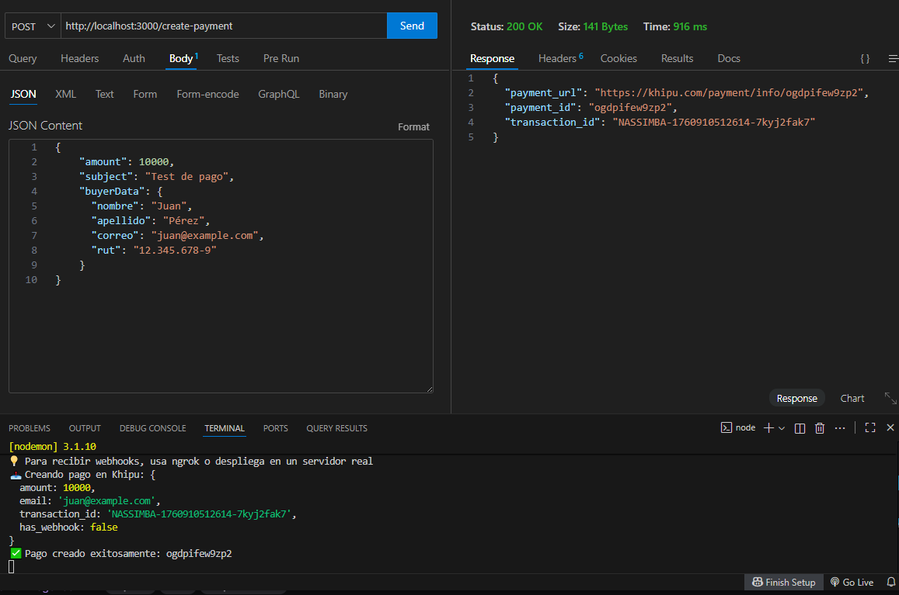
### Pago sin monto
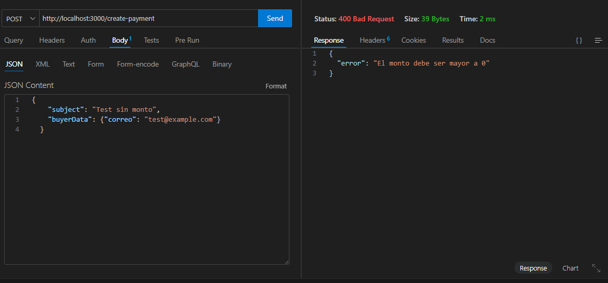
### Pago sin email
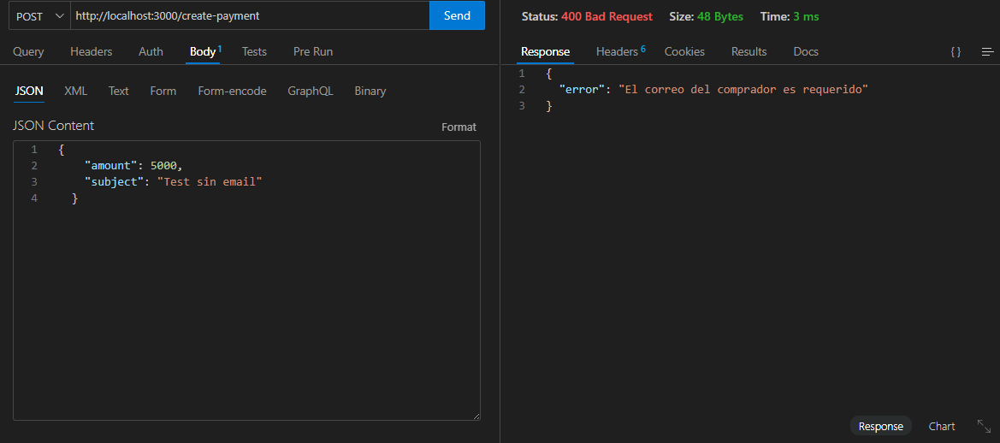
### Status del pago
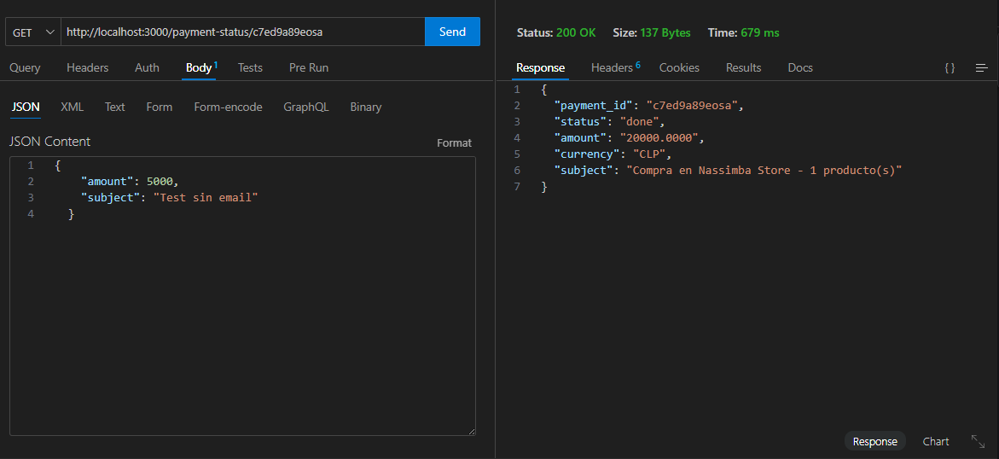
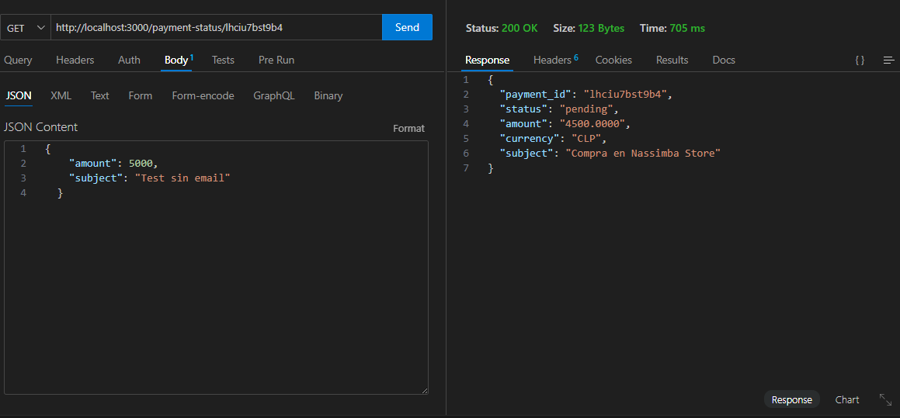
### Status de pago inexistente
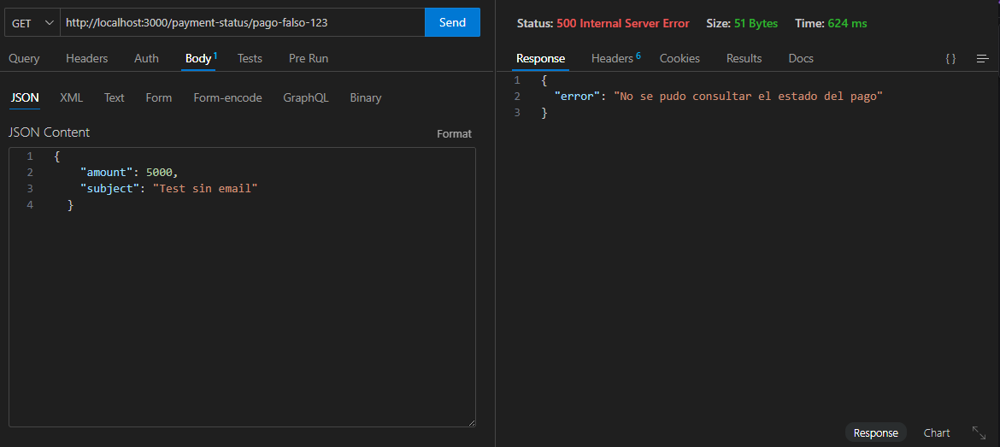
### WebHook de notitificación de pago exitoso
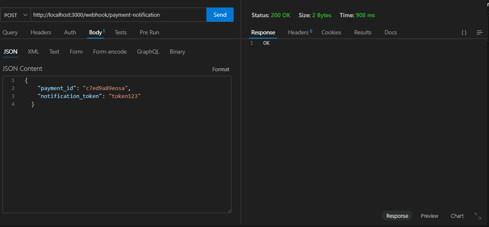
### Detalle pagos creados
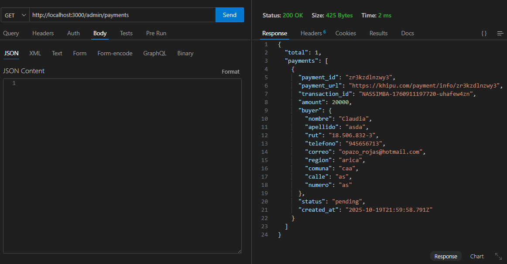
### Detalle de un pago en específico
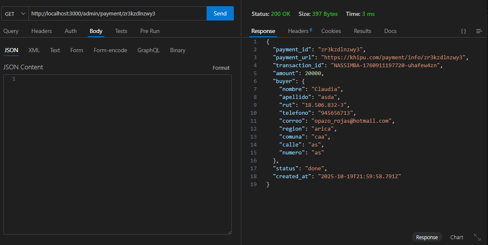
### Bancos disponibles
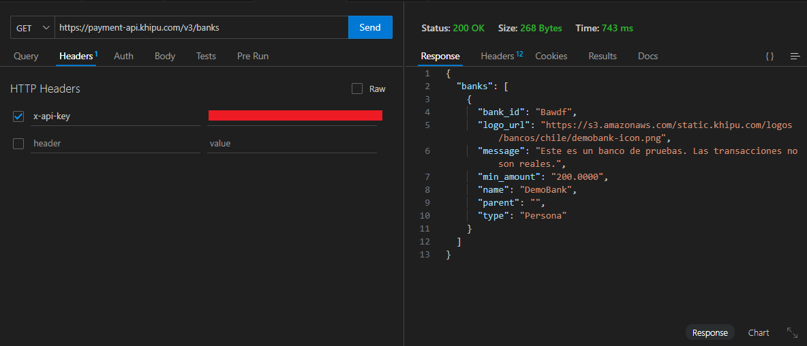
### Confirmar pago manual
##### No fue posible de utilizar
### Borrar pago

### Devolución pago
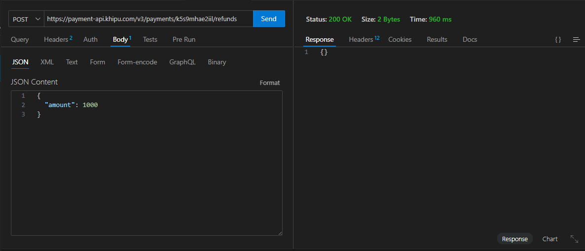
### Métodos de pago
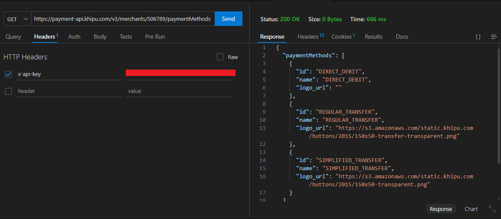
### Crear nueva cuenta de cobro
##### No fue posible de utilizar

## Pruebas Flujo completo

### Escenario 1 - Compra Exitosa

#### Demo Bank

#### Transferencia Manual

### Escenario 2 - Pago Cancelado
#### "Volver al sitio de origen"

